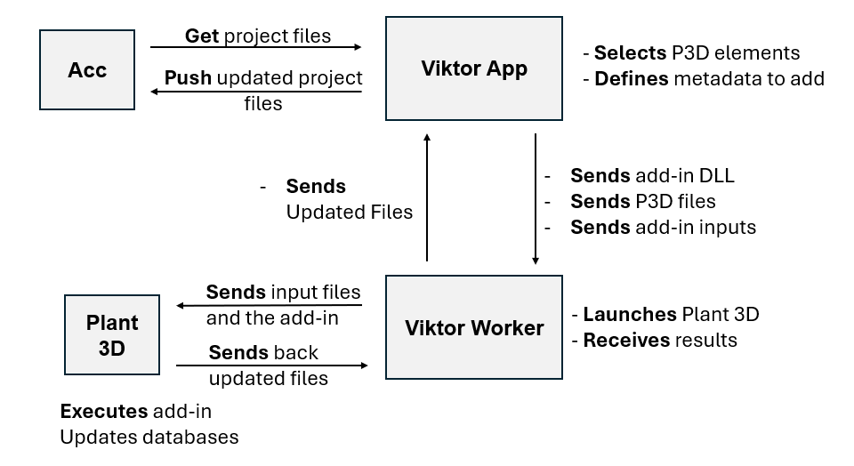

# Add Parameters to Plant3D Entities

This VIKTOR application uses ACC integration and the VIKTOR Worker to add custom metadata parameters to Plant 3D entities based on their PID tags.


## Workflow Overview



The application orchestrates a multi-step workflow between Autodesk Construction Cloud (ACC), the VIKTOR App, a VIKTOR Worker, and Plant 3D:

### 1. **User Configuration (VIKTOR App)**
   - User selects a Plant 3D model from ACC
   - Selects a viewable/model from the Plant 3D project
   - Defines metadata to add by selecting PID tags and specifying parameter names and values
   - Selects the Project.xml file to identify the Plant 3D project

### 2. **Download Phase (ACC → VIKTOR App)**
   - When the user clicks "Run Worker", the app downloads all files from the Plant 3D project folder in ACC
   - Creates a manifest file tracking all downloaded files and their ACC locations
   - Zips the project files for transfer to the worker

### 3. **Worker Preparation (VIKTOR App → VIKTOR Worker)**
   - The app packages three items to send to the worker:
     - **addin_input.json**: Contains the tag-to-metadata mappings defined by the user
     - **p3d_project.zip**: The downloaded Plant 3D project files
     - **addin.zip**: The C# DLL add-in that will modify Plant 3D

### 4. **Worker Execution (VIKTOR Worker → Plant 3D)**
   - The worker receives the input files and the add-in
   - Extracts the Plant 3D project files
   - Launches Plant 3D in automated mode
   - Loads and executes the C# add-in with the metadata instructions

### 5. **Plant 3D Processing**
   - The add-in reads addin_input.json
   - Iterates through Plant 3D elements matching the specified tags
   - Updates the element databases with the new custom parameters
   - Saves the modified project files

### 6. **Return Results (Plant 3D → VIKTOR Worker → VIKTOR App)**
   - Plant 3D closes and returns control to the worker
   - The worker zips the updated project files
   - Sends back:
     - **plant_run.jsonl**: Execution log with details of each operation
     - **updated_files.zip**: Modified Plant 3D project files

### 7. **Upload Phase (VIKTOR App → ACC)**
   - The app receives the updated files
   - Uses the manifest to identify which files changed
   - Uploads only the modified files back to ACC
   - Provides a summary report: files uploaded, skipped, or errors

## Prerequisites

### Required Integrations
1. **Autodesk Construction Cloud (ACC)** - [Setup Guide](https://docs.viktor.ai/docs/create-apps/software-integrations/autodesk-construction-cloud/)
2. **Autodesk Platform Services (APS)** - [Setup Guide](https://docs.viktor.ai/docs/create-apps/software-integrations/autodesk-platform-services/)
   - Both require OAuth2 configuration

### Python Worker Setup
A Python worker must be configured and running on a machine with Plant 3D installed.

- **Worker Overview**: [General Documentation](https://docs.viktor.ai/docs/create-apps/software-integrations/#workers)
- **Python Worker**: [API Reference](https://docs.viktor.ai/sdk/api/external/python/)

The worker is an executable that runs on the user's server or computer where Plant 3D is installed. It connects the VIKTOR application to the local Plant 3D installation, enabling automated execution of the add-in.

## Installation

1. Clone this repository:
   ```bash
   git clone <repository-url>
   cd plant3d-add-params
   ```

2. Update `viktor.config.toml` with your ACC OAuth2 integration name

3. Update the Plant 3D installation path in `app/run_addin.py` to match your system

4. Install dependencies:
   ```bash
   pip install -r requirements.txt
   ```

5. Publish to VIKTOR:
   ```bash
   viktor-cli publish
   ```

## How to Use

1. **Select Plant 3D Model**: Choose your Plant 3D model from ACC
2. **Select Viewable**: Pick the specific viewable/model to work with
3. **Configure Tag Parameters**: Add rows specifying:
   - PID Tag (e.g., "AV-309")
   - Parameter Name (e.g., "Vendor")
   - Value (e.g., "Siemens")
4. **Select Project XML**: Choose the Project.xml file from your Plant 3D project
5. **Run Worker**: Click the button to execute the entire pipeline

The app will:
- Download the project
- Send files to the worker
- Execute Plant 3D with the add-in
- Receive updated files
- Upload changes back to ACC

## Technical Details

### Key Components
- **app.py**: Main VIKTOR application with UI and orchestration logic
- **run_addin.py**: Worker script that launches Plant 3D and loads the add-in
- **addin/**: C# project for the Plant 3D add-in (MetadataApplier.dll)
- **acc_helpers.py**: Helper functions for ACC file operations

- Tested with **Plant 3D 2026**
- The worker must run on a Windows machine with Plant 3D installed
- Ensure Plant 3D is not open when the worker executes
- The manifest file is crucial for tracking and uploading only changed files
